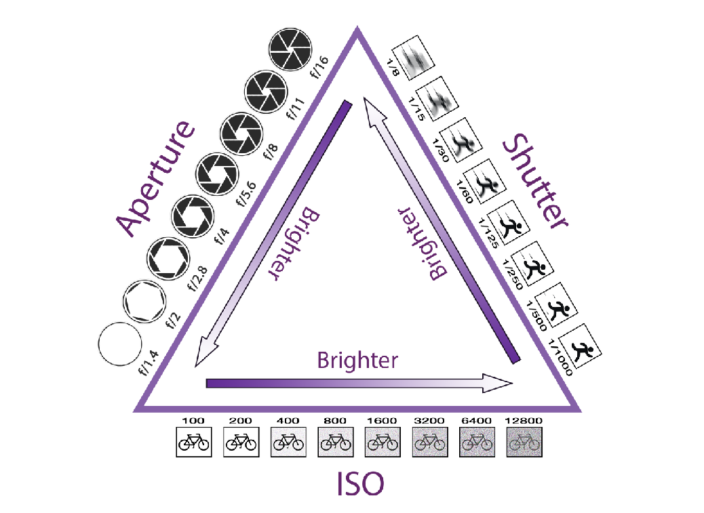
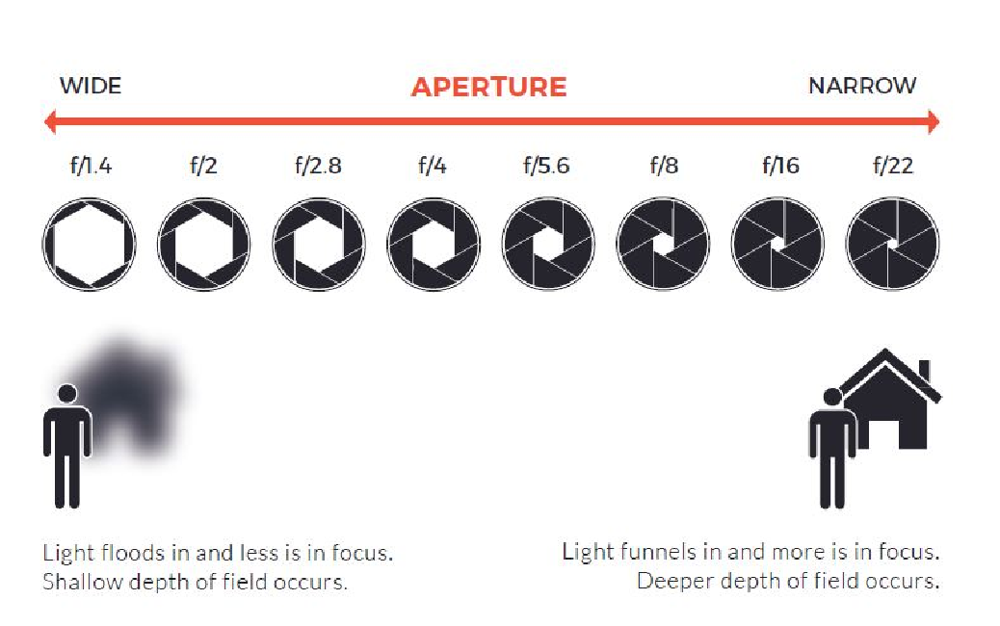
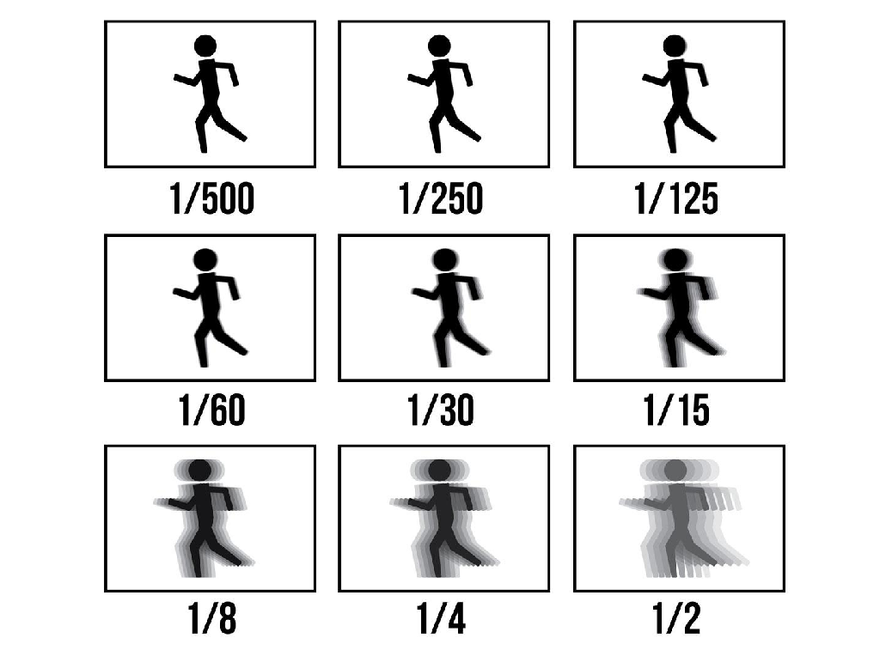
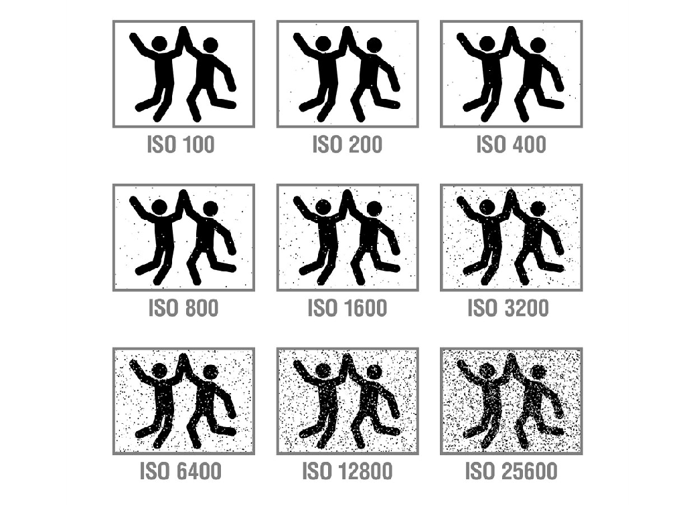

---
tags:
  - complete
date: 2024-10-09
teacher: Ms. Preeti Tyagi
---
# Digital Storytelling 5
# Photography
The great pictures just stop time. They capture something that did not continue. It just was then, and that was the perfect moment. It wasn’t the moment before. It wasn’t the moment after. It was that moment.
## Basics of Photography
**Cornerstones of a “Great Exposure”**
- Sharp Focus with Crystal Clear Details
- Great Composition
- Alignments 
- Intent

## Aperature

## Shutter

## Iso

## Compositions
- Rule of thirds
- Leading lines
- Fill the frame
## Honorable Mentions
- Golden angle
- Centered and symmetrical
- Patterns and textures

Get a well exposed & perfectly sharp image that you can work with. You can never know what it may become.
## Tips
- Leave breathing space all around
- Practice being steady
- Avoid portrait orientation
- Focus
- Keep horizontal & vertical lines in check
- Cropping
## Resources
- https://capturetheatlas.com/photography-basics/
- https://petapixel.com/2016/09/14/20-composition-techniques-will-improve-photos/
- http://www.canonoutsideofauto.ca/play/
- http://www.andersenimages.com/tutorials/exposure-simulator/
- http://photography-mapped.com/interact.html
- https://dima.fi/exposure/
- http://bethecamera.com/

----------------------------------------------------------------
# Editor's Notes