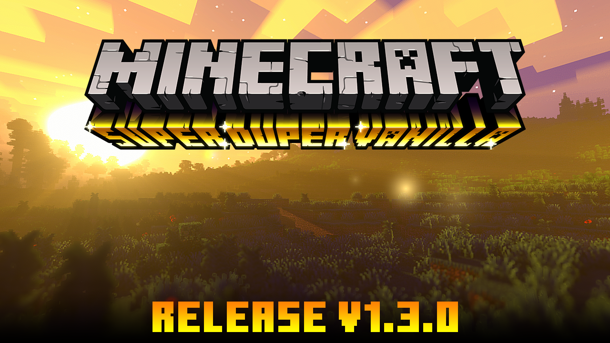

# Digital Visual Design 2
Tags: [Digital Visual Design](../../Tags/Digital%20Visual%20Design.md)
## References
- 
----------------------------------------------------------------
# Editor's Notes
## Graphic Design
Focuses on articulating meaning for example advertisements.
- Inform users
- Attract users
- Entice users
- Inspire users
## Visual Design
Focuses on the practical usage and aesthetics for example user interface.
- Support users use a product or service most efficiently
- Make the stay pleasant and comfortable
## Activity
Research and write down 5 types of Graphic Design
- Portfolios

- Thumbnails

- Logos

- Presentations

- Banners

[Factorio - Trailer 2020 (youtube.com)](https://www.youtube.com/watch?v=J8SBp4SyvLc)
## 8 Types of Graphic Design

## Visual Identity

## Psychological Perspective

## Practical Perspective

## Perspective, Position, and Context Matters
- Perspective matters
	- Aerial Perspective
	- Landscape Perspective
- Position matters
	- Golden Ratio
	- 3x3 Grid

All points together create a context in our minds that defines a story that resonates to the user's brain through imagination.
## Website Analysis
Factorio has a consistent and elegant theme of steampunk, technology, and chaos yet in control. I wouldn't change anything about it as it resonates with my past experience as a developer, a problem solver, and a player. The website makes me wants me to expand, solve, develop, and conquer. The factory MUST GROW!