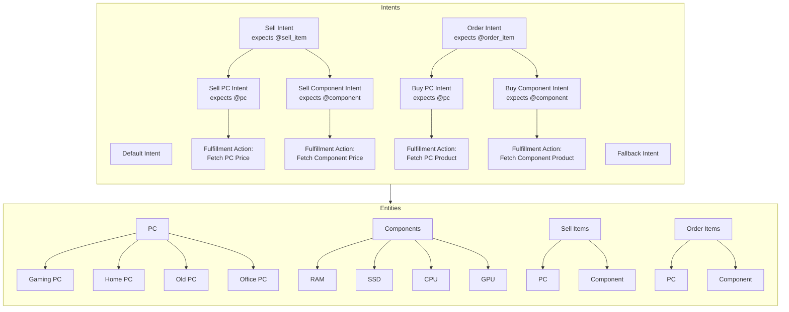

---
tags:
  - incomplete
date: 2026-04-02
teacher: Ms. Zainab
---
# Emerging Technologies 5

# Dataset Sources

- [Federal Reserve Economic Data | FRED | St. Louis Fed](https://fred.stlouisfed.org/)
- [Our World in Data](https://ourworldindata.org/)
- [Your Gateway to NASA Earth Observation Data | NASA Earthdata](https://www.earthdata.nasa.gov/)
- [PDS: Data Search](https://pds.nasa.gov/datasearch/data-search/)
- [How-To Videos | Tableau Public](https://public.tableau.com/app/learn/how-to-videos)
- [Find Open Datasets for AI and Research | Kaggle](https://www.kaggle.com/datasets)
# Topics 2 Pick
- [History of Technology Timeline | Evolution, Digital, Medical, Information, Education, & Communication | Britannica](https://www.britannica.com/story/history-of-technology-timeline)
- [SEA-ME-WE 3 - Wikipedia](https://en.wikipedia.org/wiki/SEA-ME-WE_3)
- [Optical fiber - Wikipedia](https://en.wikipedia.org/wiki/Optical_fiber)
- [Dubai Fountain, The Dancing Water Fountain – UAE - Traveldigg.com](https://traveldigg.com/dubai-fountain/)

- [x] [Computational capacity of the fastest supercomputers](https://ourworldindata.org/grapher/supercomputer-power-flops)
- [x] [Historical price of computer memory and storage](https://ourworldindata.org/grapher/historical-cost-of-computer-memory-and-storage)
- [x] [Adoption of communication technologies per 100 people, World](https://ourworldindata.org/grapher/ict-adoption-per-100-people)
- [x] [Computation used to train notable artificial intelligence systems, by domain](https://ourworldindata.org/grapher/artificial-intelligence-training-computation?time=1950-07-02..2026-02-17)
- [x] [Artificial intelligence: Performance on knowledge tests vs. training computation](https://ourworldindata.org/grapher/ai-performance-knowledge-tests-vs-training-computation)

- Technology
	- Mobiles
	- Computers
- Global Waste
	- Plastic Waste
	- Food Waste
- Education
	- Online Learning
	- Traditional Learning
- Internet
	- Social Media
	- Games
# Dialogflow Agent

# Outline Structure

**I. Introduction**
**II. Data Visualization**
	A. Main Context
		1. Dataset 1
		2. Dataset 2
		3. Dataset 3
		4. Dataset 4
		5. Dataset 5
	B. Key Decisions
	C. Critical Reflection
**III. Dialogflow Agent**
	A. Main Context
	B. Key Decisions
	C. Critical Reflection

----------------------------------------------------------------
# Editor's Notes