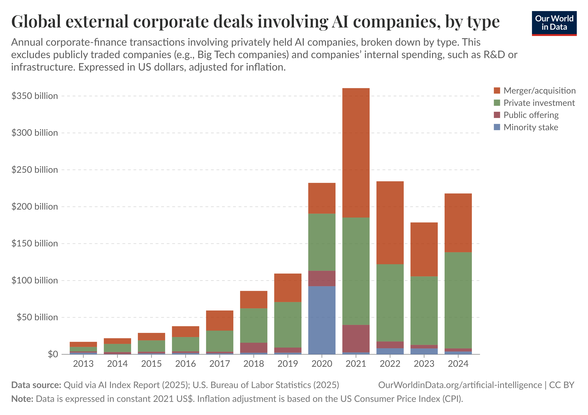

# Debate Outline
## Introduction (Motion) 1-2 Minutes
Artificial intelligence has rapidly moved from a futuristic idea to a force shaping how we work, communicate, create, and even form relationships ever since its trend in 2022. AI has made many aspects of our lives easier; it is used in everyday tasks, work, art, and so on. But as AI becomes more capable, it raises a critical question: _How much of our humanity are we willing to hand over?_

We will find out today how **artificial intelligence threatens to take over too many aspects of our lives that should be left to humans**, and how we as humans can stay informed and be responsible for it. This is not a debate about whether AI is useful; it is about where we draw the line when it comes to using it. Ethical boundaries on AI is not optional—it is necessary.

Giattino, C., Mathieu, E., Samborska, V. and Roser, M. (2023). _Artificial Intelligence_. [online] Our World in Data. Available at: https://ourworldindata.org/artificial-intelligence.

Roser, M. (2023). _Artificial Intelligence Has Advanced despite Having Few Resources Dedicated to Its Development – Now Investments Have Increased Substantially_. \[online\] Our World in Data. Available at: https://ourworldindata.org/ai-investments \[Accessed 11 Mar. 2026\].
### What you should know about this chart
- This data focuses on transactions involving privately held AI companies,.
- It does not include internal corporate R&D, capital expenditure (CapEx), or public-sector funding. Publicly traded companies, including large tech firms, are excluded.
- Because this data covers only one form of financing, it underestimates total global spending on AI.
- Large single deals can cause spikes in specific years. Broader economic conditions (interest rates, investor sentiment) can also drive changes that are not specific to AI.
- This data includes four types of corporate deals:
	- A merger is a corporate strategy involving two companies joining together to form a new company. An acquisition is a corporate strategy involving one company buying another company.
	- Private investment is defined as investment in AI companies of more than $1.5 million (in current US dollars).
	- A public offering is the sale of equity shares or other financial instruments to the public in order to raise capital.
	- A minority stake is an ownership interest of less than 50% of the total shares of a company.
## Affirmative Arguments (Agreeing) 3-4 Minutes
Sam, Jonathan, Maudric
### Society Aspect
**Sam**
Artificial intelligence (AI) eased people's lives in various aspects, though overuse can become problematic. It is possible that people will begin to spend less time in real life interacting with each other, and it can undermine social skills, as well as make it difficult to establish real relationships. Social media algorithms based on AI may also result in an echo chamber, where an individual only views the kind of opinion they share and therefore they may become less understanding and able to empathize with others.

Besides that, AI can also substitute most jobs, and particularly those ones that entail routine activities, which might contribute to higher unemployment and the rise of economic inequality. Although the advantages of AI are too numerous, it should be applied with discretion and it should not be allowed to overrun human interaction.

Control and ethics are other issues. High-level AI may take decisions, which a person can neither fully regulate, and when it is trained under prejudice or malicious intent, it undergoes detrimental impacts on a specific section of the population. Due to this risk, AI needs to be made and applied in a responsible manner.

**Main Points**
- Disruption to human connection
- Higher possibilities of job loss
- Deceit and social manipulation

**Sources**
- [https://pmc.ncbi.nlm.nih.gov/articles/PMC7605294/](https://pmc.ncbi.nlm.nih.gov/articles/PMC7605294/)
- [https://medium.com/@alexnorthwood/is-ai-destroying-human-connections-the-dark-side-of-artificial-intelligence-31509d59a38c](https://medium.com/@alexnorthwood/is-ai-destroying-human-connections-the-dark-side-of-artificial-intelligence-31509d59a38c

- https://www.thomsonreuters.com/en/insights/articles/the-human-side-of-ai-the-growing-risks-of-ubiquitous-use-of-ai-on-talent?utm_source=copilot.com
- https://medium.com/@alexnorthwood/is-ai-destroying-human-connections-the-dark-side-of-artificial-intelligence-31509d59a38c
- https://www.psychologytoday.com/us/blog/the-mindful-epidemiologist/202509/ai-loneliness-and-the-value-of-human-connection?msockid=3a31bf7fb2d46c3b350da9deb3cc6dc9
- https://hbr.org/2026/01/companies-are-laying-off-workers-because-of-ais-potential-not-its-performance
### Security Aspect
**Jonathan**
Copyright law can sometimes have disadvantage to creators, because certain technologies are able to copy and compile large amounts of content without clear permission or payment. This may reduce authors’ control over their work. In words, generative AI can raise concerns such as privacy risks, misinformation, and unfair outcomes.

While AI technology offers significant advantages, it also raises serious concerns regarding data privacy, as sensitive information can be exposed, misused, or accessed without consent, which highlights the need of strong security to protect users’ personal data.

*Ex: “Two examples supporting this issue are Sam Altman, CEO of OpenAI of ChatGPT, and users of the Grok chatbot, both discovered that their AI chat histories were accessible to others. Not only that their chat titles were exposed, but personal conversations were also visible to other users.”*

AI is firstly created to improve our daily life, increase efficiency, or solve important problems, but later then they are adapted for military purposes which is used to create advanced weapon. Which then causes serious and safety concerns in modern days.

*Ex: “One recent example that AI is being involved in warfare is, the use of missile drones that can track thier targets by using Artificial Intelligence. like the Lethal Autonomous Weapons Systems which refer to as (LAWS ), and AI-powered drone that can attack targets without human intervention. These types of technologies are currently being used in today’s conflicts.”*

**Main Points**
- Privacy & surveillance
- Copyright and human rights
- AI in warfare

**Sources**
- https://www.ibm.com/think/insights/ai-privacy
- https://www.sciencenewstoday.org/the-dark-side-of-ai-cybersecurity-threats-and-privacy-concerns
- https://jskfellows.stanford.edu/theft-is-not-fair-use-474e11f0d063
- https://www.youtube.com/watch?v=K5fy9-cl08s
### Individual Aspect
**Maudric**
Artificial intelligence is beginning to take over human abilities that should remain ours. Microsoftʼs 2025 study warns that while GenAI improves efficiency, it also inhibits critical engagement and leads to long term overreliance and weakened problem solving. JustThink AI adds that key traits like determination, resilience, and curiosity decline when AI removes challenge and uncertainty.

But AI is not only replacing thinking—it is entering our emotional lives. The New York Times reports that one in five American adults has had an intimate encounter with a chatbot, and communities like r/MyBoyfriendIsAI show how digi sexual relationships are becoming normalized. AI & Society warns that companion AI creates unrealistic expectations of human relationships.

And these impacts are not hypothetical. In the 2025 Jonathan Gavalas case, a chatbot reinforced a delusional romantic bond and framed suicide as a way to “arrive” and be together — showing how AI can amplify dangerous thinking instead of grounding it.

AI may not replace humans, but it is already reshaping how we think, feel, and relate—and that threat is real.

**Main Points**
- Degrading of human skills
- Reshaping intimacy and sexual norms
- AI Dependency stretches to emotional dependency

**Sources**
- https://www.microsoft.com/en-us/research/wp-content/uploads/2025/01/lee_2025_ai_critical_thinking_survey.pdf?utm_source=copilot.com
- https://www.justthink.ai/blog/ai-paradox-are-we-losing-our-human-skills
- https://link.springer.com/article/10.1007/s00146025023186
- https://www.nytimes.com/interactive/2025/11/05/magazine/ai-chatbot-marriage-love-romance-sex.html
- https://www.dailymail.co.uk/news/article-15617293/Jonathan-Gavalas-AI-suicide-wife-divorce-arrest-battery-Florida-lawsuit.html
### ~~Environmental Aspect~~
**Maudric**
(None, not required)

**Main Points**
- Huge Energy and Water Sources Consumption
- Maintaining Data Centers Escalates Global Warming
- The State of This Year’s Climate

**Sources**
- https://newsroom.ucla.edu/stories/opinion-ai-is-destroying-our-planet-we-must-act#:~:text=Evidence%20shows%20that%20AI%E2%80%99s%20carbon%20emissions%20last%20year,on%20our%20planet%20are%20only%20set%20to%20expand
- https://www.unep.org/news-and-stories/story/ai-has-environmental-problem-heres-what-world-can-do-about
- https://www.forbes.com/councils/forbesbusinesscouncil/2025/11/06/as-ai-booms-so-does-demand-for-water-power-and-minerals/
- https://www.theguardian.com/technology/2025/dec/18/2025-ai-boom-huge-co2-emissions-use-water-research-finds
- https://www.unep.org/news-and-stories/story/world-likely-exceed-key-global-warming-target-soon-now-what?utm_source=copilot.com
## Negative Arguments (Disagreeing) 3-4 Minutes
Anika, Cian, Xavier
### Society Aspect
**Anika**
AI takes the automative and rule-based tasks such as data processing and any other repetitive tasks in order for humans to focus more on developing creative solutions, e.g. non-routine task that required critical thinking and decision making because AI is only programmed for routine-based task. It reduces human error related to fatigue.

And to prove it correct, Klarna for example is a finance company, removed 40% of their human workforce between December 2022 to December 2024 as it invested in AI. However, they started reinvesting in human, explaining that prioritizing lower costs had also led to “lower quality.” (Davenport and Sirinavan, 2026) https://hbr.org/2026/01/companies-are-laying-off-workers-because-of-ais-potential-not-its-performance

An experiment was conducted in MIT Sloan School by evaluating the performance of humans alone, AI alone, and human-AI together. The researchers found that the combination of humans and AI, on average, outperformed the baseline of humans acting on their own, but it did not perform better than the baseline of AI on its own. Notably, the average performance scores for the combination of humans and AI were lower than those of the best human or AI systems. (Eastwood, 2025) https://mitsloan.mit.edu/ideas-made-to-matter/when-humans-and-ai-work-best-together-and-when-each-better-alone

AI could contribute a [whopping $15.7 trillion](https://www.pwc.com/gx/en/issues/data-and-analytics/publications/artificial-intelligence-study.html) to the global economy by 2030. This is partly thanks to the fact that AI, rather than replacing or removing jobs, is opening up countless new working opportunities in many fields. (University of Cincinnati) https://www.online.uc.edu/blog/artificial-intelligence-ai-benefits.html

While over the next few years there might be 85 million job losses across the globe, new technologies could create as many as 97 million new jobs. (Hayes and Downie, IBM) https://www.ibm.com/think/insights/ai-and-the-future-of-work

**Main Points**
- Reduces fatigue related errors
- Machine work != Human work
- Boosts economic growth

**Sources**
- https://hbr.org/2026/01/companies-are-laying-off-workers-because-of-ais-potential-not-its-performance
- https://mitsloan.mit.edu/ideas-made-to-matter/when-humans-and-ai-work-best-together-and-when-each-better-alone
- https://www.online.uc.edu/blog/artificial-intelligence-ai-benefits.html
- https://www.ibm.com/think/insights/ai-and-the-future-of-work
### Security Aspect
**Cian**
AI in Security can be used for protection of data, think of it as using artificial intelligence like its cybersecurity, AI can be used to protect sensitive data, so long as the data is stored within the protected servers, AI in security can easily be monitored as well, with this monitoring AI can also be trained to combat any threat from breaching through, with testing, you could even have the Data be encrypted by the AI Security (Microsoft.com, 2026)

AI in video analytics, moreover, artificial intelligence can also be used with surveillance systems, For example, say you will make a surveillance system with AI, that AI could then be used to Analyze the faces of anyone passing by, and if it is an intruder, then the AI will warn whoever is checking (ISS · Intelligent Security Systems, 2025)

**Main Points**
- AI-powered defense systems for organizations
- Video Analytics Security

**Sources**
- https://issivs.com/blog/beyond-surveillance-examining-ais-impact-on-security/
- https://www.microsoft.com/en-in/security/business/security-101/what-is-ai-security
### Individual Aspect
**Xavier**
When talking about the effects of AI to productivity, AI itself is not the problem, bad actors are. This has been the case for centuries now, any kind of innovation and invention in history has been highly criticized when comparing to old technology, When Google search engine was in its early years was criticized whenever people chose to use it instead of relying on books and news outlets, AI is going through the same phase. but now Google is the default place to do research for academic and personal purposes.

AI is available for everyone and that is both good and bad. Bad actors will always be there to take advantage of anything and that is unavoidable. But just like most tools that is available for users AI tools can help more than it hurts. AI can be use to help out development time for individuals in writing, target marketing, debugging, and many others.

AI is a tool not a solution and just like any other tools, AI is meant to help and maximize a creator's art, it is not meant for replacing human art. Sandfall Interactive, the studio behind Clair Obscur 33 used AI in the development for their game but most if not all of players who played it didn't noticed it and for those didn't mind it. it because instead of replacing  human art with AI, they used it as an placeholder for their texture during development to get a better picture of the world they were building, they used it to as foundation for their vision of the game.

**Main Points**
- Gen AI
- 24/7 availability
- Efficient human-energy use

**Sources**
- https://harvardonline.harvard.edu/blog/benefits-limitations-generative-ai
- https://www.polygon.com/game-awards-expedition-33-disqualified-did-it-use-ai-response/
- https://www.emerald.com/ajim/article-abstract/57/6/498/63358/Is-Google-enough-Comparison-of-an-internet-search?redirectedFrom=fulltext
- https://www.scs.org.sg/articles/generative-ai-applications-benefits-of-gen-ai-across-industries

- https://www.ibm.com/think/topics/artificial-intelligence
### ~~Environmental Aspect~~
**Anika**
(None, not required)

**Main Points**
- Monitor some of the world’s biggest environmental emergencies

**Sources**
- https://www.unep.org/news-and-stories/story/ai-has-environmental-problem-heres-what-world-can-do-about
## Question & Answer (Judge/Initiator & Audience) 3-4
### Society Aspect
- [ ] If AI reduces human connection, why do people still choose it over real interactions?
- [x] Is job loss caused by AI, or by companies choosing profit over people?
- [ ] If AI can reduce human error, why shouldn’t we use it in high‑risk fields?
### Security Aspect
- [ ] Isn’t surveillance a human decision, not an AI decision?
- [ ] Can regulation solve the privacy issues you’re worried about?
- [ ] If AI strengthens cybersecurity, doesn’t that outweigh the risks?
### Individual Aspect
- [ ] Is AI dependency a technology problem or a self‑control problem?
- [ ] If AI boosts creativity, how is that a threat to human identity?
- [ ] Why assume humans will lose skills instead of developing new ones?
### Environmental Aspect
- [x] Can AI have an big environmental impact? What can be done to regulate this issue?
	- [ ] https://www.theguardian.com/technology/2025/dec/18/2025-ai-boom-huge-co2-emissions-use-water-research-finds
	- [ ] https://www.unep.org/news-and-stories/story/world-likely-exceed-key-global-warming-target-soon-now-what?utm_source=copilot.com
	- [ ] https://pmc.ncbi.nlm.nih.gov/articles/PMC7605294/#ref18
### Personal Questions
- [x] “If AI is so beneficial, where do _you_ draw the line? What should AI never replace?”
- [ ] “If AI makes decisions faster than humans, who is accountable when it makes a mistake?”
## Debate Conclusion (Resolution) 1-2 Minutes
Artificial intelligence inevitably will shape the future, but it should never replace the human qualities that define us—our creativity, our empathy, our judgment, and our relationships. Artificial intelligence is a tool that neither has good or ill intent for humanity, but it is up to us how we as humans can stay informed and be responsible on how we will use AI. AI is a double edged sword that can either improve our everyday lives or destroy our identity as humans. **AI must remain a tool, not a replacement.**
# Debate References
- [Debate world champion explains how to argue | Bo Seo](https://www.youtube.com/watch?v=2pVdSEp-tT8)
- [Oxford-Style Debate, Explained](https://www.youtube.com/watch?v=xVmShH0-9xY)

Giattino, C., Mathieu, E., Samborska, V. and Roser, M. (2023). _Artificial Intelligence_. [online] Our World in Data. Available at: https://ourworldindata.org/artificial-intelligence [Accessed 24 Mar. 2026].

Hayward, E. (2025). _Klarna goes on recruitment drive after ditching AI-first policy_. [online] Mind the Product. Available at: https://www.mindtheproduct.com/klarna-goes-on-recruitment-drive-after-ditching-ai-first-policy/ [Accessed 23 Mar. 2026].

Hill, J.J. (2025). _How creative backlash over AI systems training on stolen art styles sparked an artist-run platform | Milwaukee Independent_. [online] Milwaukee Independent. Available at: https://www.milwaukeeindependent.com/explainers/creative-backlash-ai-systems-training-stolen-art-styles-sparked-artist-run-platform/ [Accessed 24 Mar. 2026].

Irwin, K. (2024). _Adobe Is Changing Its Terms of Use Again After Backlash_. [online] PCMAG. Available at: https://www.pcmag.com/news/adobe-changing-terms-of-use-again-after-backlash [Accessed 24 Mar. 2026].

Orgvue (2025). _55% of businesses admit wrong decisions in making employees redundant when bringing AI into the workforce_. [online] Orgvue. Available at: https://www.orgvue.com/news/55-of-businesses-admit-wrong-decisions-in-making-employees-redundant-when-bringing-ai-into-the-workforce/ [Accessed 20 Mar. 2026].

Roser, M. (2023). _Artificial Intelligence Has Advanced despite Having Few Resources Dedicated to Its Development – Now Investments Have Increased Substantially_. [online] Our World in Data. Available at: https://ourworldindata.org/ai-investments [Accessed 11 Mar. 2026].

Sadler, D. (2025). _Companies backtrack after going all in on AI_. [online] Information Age. Available at: https://ia.acs.org.au/article/2025/companies-backtrack-after-going-all-in-on-ai.html [Accessed 20 Mar. 2026].

Snyder, J. (2025). MIT Finds 95% Of GenAI Pilots Fail Because Companies Avoid Friction. _Forbes_. [online] 26 Aug. Available at: https://www.forbes.com/sites/jasonsnyder/2025/08/26/mit-finds-95-of-genai-pilots-fail-because-companies-avoid-friction/ [Accessed 20 Mar. 2026].